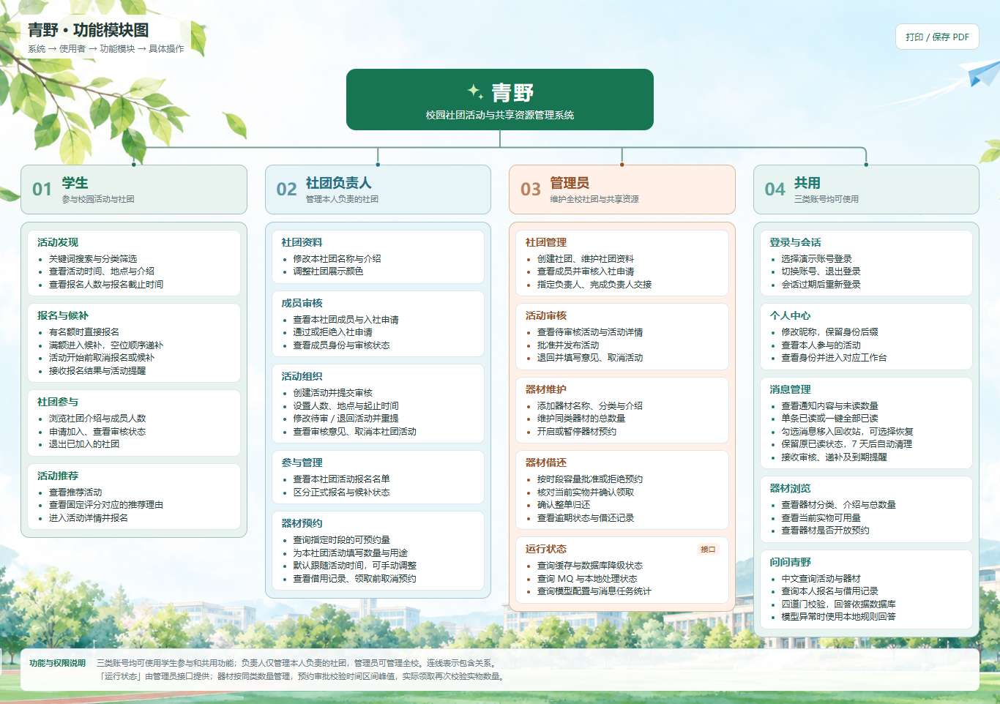

# 青野

**校园社团活动与共享资源管理系统的设计与实现**

Java 17 / Spring Boot 单体、MySQL 8、原生微信小程序。主线是「社团 → 活动 → 报名 / 候补 → 器材预约 → 审批 → 领取 → 归还」，三类用户共用小程序，管理操作在工作台完成。Redis、RabbitMQ 和模型能力可降级。

## 功能模块图

[](docs/功能模块图.html)

四列分别展示学生、社团负责人、管理员与共用功能。需要修改或打印时，下载 [HTML 模块图](docs/功能模块图.html) 离线打开；校园背景已内嵌，无需联网。

## 运行

1. 在 MySQL 客户端或 Navicat 完整执行 [sql/qingye.sql](sql/qingye.sql)。单个文件包含建库、九张表和五个演示身份及业务数据。重复导入会替换 `qingye` 中的同名表；已有正常数据时无需再次导入。快照保留当时的活动日期，日期过期后可在工作台取消旧活动并创建新的演示活动。

2. 准备 Java 17、Maven、MySQL 8、微信开发者工具。在青野目录运行：

   ```powershell
   $env:QINGYE_DB_USER = '<数据库账号>'
   $env:QINGYE_DB_PASSWORD = '<数据库密码>'
   cd backend
   mvn "-DskipTests" package
   cd ..
   .\scripts\start.ps1 -SkipBuild
   # 可选：启用本机已运行的中间件
   # .\scripts\start.ps1 -SkipBuild -Redis -Mq
   ```

   首次构建用普通 Maven 下载所需依赖；缓存齐全后可离线构建。默认后端为 `http://127.0.0.1:8087`。也可在 IDEA 导入 `backend/pom.xml`，为运行配置设置上述数据库环境变量及 `QINGYE_DEMO=true`，运行 `cn.qingye.QingyeApplication`。再次构建前先停止正在运行的青野，避免 Windows 锁定 JAR。

3. 微信开发者工具导入 **`miniprogram/`**，导入时选择自己的开发或测试 AppID；仓库配置中的 `touristappid` 是占位值。开发阶段关闭合法域名校验，编译后选择演示身份。前端通过 `wx.request` 直接连接后端，不需要 Node 业务服务或网页前端监听端口。

真机预览时，手机与电脑接入同一局域网，将 `miniprogram/utils/config.js` 的地址改成电脑当前局域网 IP，并设置 `QINGYE_BIND=0.0.0.0` 后重启后端。端口可由 `QINGYE_PORT` 指定。数据库密码、模型密钥等仅放环境变量或被忽略的 `local.ps1`；私人 AppID 配置、构建产物与日志不提交。

首次使用空库时，演示模式可初始化演示数据；已有库只补充必要表结构，不重置业务记录。这个项目使用本机软件，不要求 Docker 或 uni-app。

## 项目说明

- [项目简介](docs/项目简介.md)：功能、九张表、后端分层、核心算法、降级与验收范围。
- [功能模块图](docs/功能模块图.html)：按学生、社团负责人、管理员、共用四列并列，分别向下展开；下载后双击离线查看或打印。
- [运行素材说明](miniprogram/assets/README.md)：小程序实际使用的校园、器材图片及图标许可。

器材按同类数量预约。时间区间峰值扫描计算容量，MySQL 行锁保护最终审批；领取时再次核对全部未归还数量。负责人权限来自具体社团成员关系。消息可全部已读，也可选择后移入回收站；7 天内可选择恢复并保留已读状态，到期自动清理。

登录页在身份列表加载或登录失败时显示故障卡片，区分 403、404、429、5xx、断网、超时和无效响应；可重试或返回选择身份。只有有效的登录响应才能建立会话，已登录接口的 401 仍退出过期会话。

校园助手只支持中文校园只读查询。模型只能产生白名单参数，不能生成 SQL、用户身份或最终事实回答；未配置或异常时使用本地规则。助手明确拒绝他人私有记录、凭据、权限冒充和写操作；模型计划必须与本地查询类型一致，响应仅包含展示字段。完整外部请求有截止时间，同一账号同时最多一次、单实例最多四次外部解析，其余请求使用本地规则。模型密钥仅通过本机环境变量提供，不随源码交付。以后接模型可在环境变量设置 `QINGYE_LLM_URL`（完整 chat-completions 地址）、`QINGYE_LLM_KEY`、`QINGYE_LLM_MODEL`。

## 工程维护与复验

青野继续位于dome，原提交历史保留。自己的测试和门禁限定在`qingye/`；[独立CI](../.github/workflows/qingye-ci.yml)按该目录变更触发，不以浏览器演示构建代替后端验收。

Java17、Maven3.9、Python3.10+、Node24.14.0。从本目录运行：

```powershell
python -B scripts/check.py quick  # 门禁 + 客户端 + H2，不连接MySQL
# 显式准备独立 qingye_test 与仅有该库权限的测试账号后：
$env:QINGYE_TEST_URL = 'jdbc:mysql://127.0.0.1:3306/qingye_test?characterEncoding=utf8&serverTimezone=Asia/Shanghai'
$env:QINGYE_TEST_USER = '<测试账号>'
$env:QINGYE_TEST_PASSWORD = '<测试密码>'
python -B scripts/check.py all    # 再执行真实MySQL测试
```

单项为`hygiene`、`client`、`h2`、`mysql`。缺工具/测试凭据或非qingye_test URL直接拒绝；MySQL测试会清空测试业务表，必须专库专用。H2命令只在子进程移除MySQL测试环境，保留调用者配置。`client`检查JSON/JS/WXML结构和实际页面脚本测试；微信原生编译另运行`python -B scripts/check-client.py --compiler-dir <现有wcc-exec目录>`，结构检查不冒充编译或真机证明。旧`test-mysql.ps1`只作为本机便利入口，CI与维护统一使用上述显式变量。

数据库DATETIME按上海本地业务时间保存，读取使用LocalDateTime，避免经JVM默认时区转换。新增CI首次在UTC宿主击穿了原日期映射，原[失败运行](https://github.com/NoctilumeDev/dome/actions/runs/37214544021)保留；修正按同样UTC条件复验。

### 遗留物收口门禁

阶段退出：实现 → 测试 → 文档/公开读回 → 遗留物收口 → 结束。`hygiene`只读检查本模块Git跟踪的已知构建/运行态/私有配置及当前文档本地链接，另有负控制；不扫描或清理其他dome项目，不自动删除图片或数据库，不单独证明LOCAL_DORMANT。

负责人还须逐项核对owner、当前consumer和proof obligation：页面/README/展示/Release依赖素材及正式证据绑定资产保留；纯历史废案在确认无当前职责后删除；首败、关键反例、最终见证和回执保留。不能因为没搜到引用就断言图片无用，也不能因为历史说明引用就永远保留废案。构建实例可重建才清；原Release/evidence包不拿新包冒充。唯一数据未知则REVIEW_REQUIRED。

本地收尾先确认源码、锁文件、SQL、配置模板与脚本已在远端，再停止自己创建的进程并清理本轮依赖/编译/临时实例；共享MySQL、中间件、其他项目及未提交用户改动保留。门禁通常只留阶段结果和必要例外，详细删除看Git diff；不创建永久删除清单，不按仓库体积考核。

截至 2026-10-02，H2 / MySQL 各 43 项、前端 39 项、十页原生编译通过；已检查并发、权限、真实中间件传输与降级。本轮 6 类真实 DeepSeek 查询、16 个本地拒绝样例及认证、参数边界通过，测试前后九张业务表内容一致；供应商正文卡住可在截止时间内降级。回收站清理、恢复、未读状态、账号隔离、空状态及定时清理已在实际编译页面验收。用户在安卓真机确认助手、预约、昵称三组键盘避让正常；其他机型未逐一验证。真实微信登录、正式 HTTPS / 微信审核、学校部署和高负载容量不属于当前验收范围。

维护以业务边界、源码可读性和可复验行为为准，不以行数作为正确性或清理指标。文档保留项目简介、模块图及主页预览截图，过程材料可在 Git 历史中查看。
